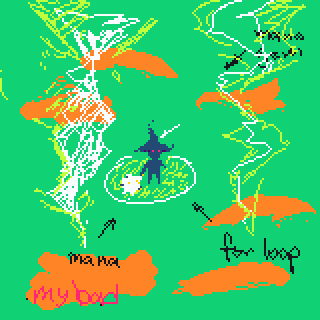
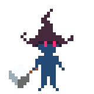

# ego:bound | boot.dev hxthn
goal: gain experience with odin and manual memory management in general

## gameplay

type as fast as possible to protect yourself from scary words! and if it there
are too many scary words, type in the `safeword` to clear the whole map. *using
the safeword is a mark of shame*





features:
- [x] capture keyboard input and `ctrl+backspace` undo
- [x] mc idle animation
- [ ] mc attack animations
- [ ] sfx/vfx
- [ ] scoring system
- [ ] game ui

## install 
requirements:
- [odin compiler](https://odin-lang.org/docs/install/)
- [just](https://github.com/casey/just)

build and run:
```
just run
```

### libraries:
- raylib: rendering
- [atlas builder](https://github.com/karl-zylinski/atlas-builder): karl zylinski's tool for creating `atlas.png` file and `atlas.odin`

### learning:
the most interesting parts involve `target`. i had the most trouble with writing
`replace_matched_prefix` procedure given that this is my first project using 
odin. it is a simple function, i spent my time reading the docs and figuring out
what api is availabe. it turns out that 

> `builder_make_len` creates a builder that already contains the given number of
> `0` bytes. So you have some number of `0` bytes, followed by the data you
> actually appended. `cstrings` are terminated by a `0` byte, and the first `N`
> bytes are `0`, so it's just an empty string
>
> -- <cite>Barinzaya(from the Odin discord server)<cite>

i have been using rust for a bit and at the start of this project, i lost
30+ mins because of an uninitialized variable. with rust, i just follow what the
compiler tells me to do, and i don't feel like i need other tools to debug rust
code. it's a lot easier to move in odin, but i feel like i need a debugger to
find my mistakes. 

if you have recommendations for a good debugger on linux, please let me know!


